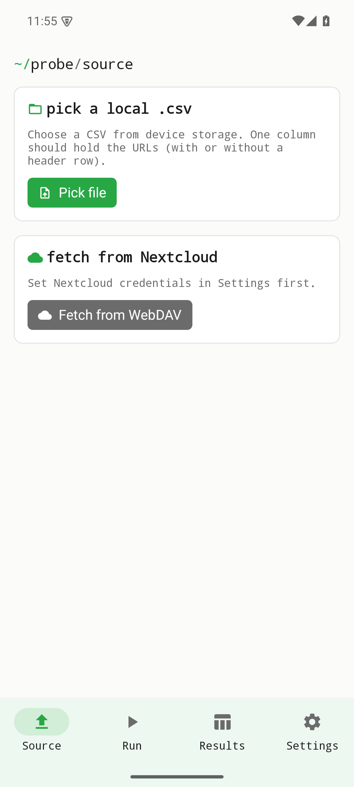
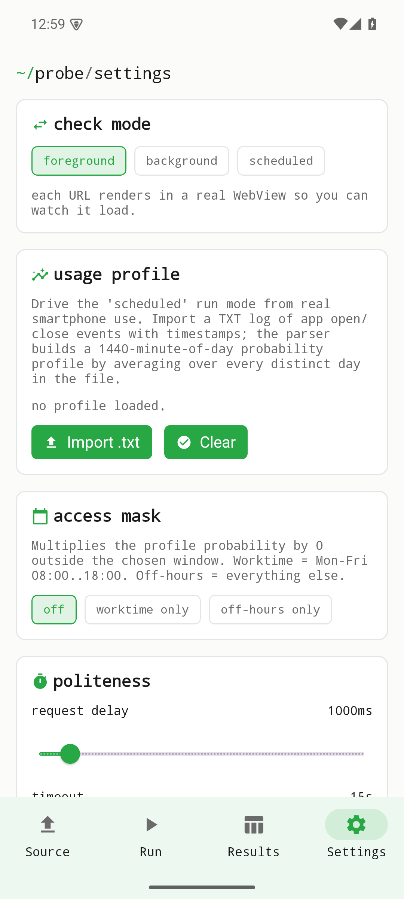

Établi Nuage est un client natif pour une instance Nextcloud auto-hébergée. Il ne parle qu'au serveur que vous lui indiquez — pas de service central, aucun tiers entre les deux. L'appli est **en développement** : Fichiers (WebDAV) et le Vérificateur de liens fonctionnent déjà en aller-retour, tandis que Contacts (CardDAV) et Calendrier (CalDAV) sont encore en cours de finition.

Les figures ci-dessous sont de vraies captures d'écran de la version v0.1.0 sur un émulateur Android. Tant qu'aucun serveur n'est configuré, l'appli reste volontairement dans un état « non connecté » et vous renvoie vers les Réglages — rien n'est récupéré avant la connexion.

## Non connecté — l'état de départ

Au premier lancement, aucun serveur Nextcloud n'est configuré : l'onglet d'accueil affiche donc un état **non connecté**. Il utilise le fil d'Ariane de style terminal de la suite (`~/probe/source`) et rend l'étape suivante explicite : choisir une CSV locale, ou renseigner le serveur et les identifiants dans les Réglages avant de récupérer quoi que ce soit depuis Nextcloud. Rien ne quitte l'appareil tant que vous n'êtes pas connecté.

{width=320}

## Réglages — serveur et identifiants

Les **Réglages** sont l'endroit où vous saisissez l'URL de votre instance Nextcloud et vos identifiants, ainsi que les options d'exécution du Vérificateur de liens (mode de vérification, profil d'usage, masque d'accès, politesse / délai entre requêtes). Une fois un serveur joignable et un mot de passe d'application valides en place, l'appli parle directement à votre instance. Les identifiants résident dans le coffre-fort sécurisé de la plateforme (Android EncryptedSharedPreferences) et ne sont envoyés qu'à l'instance configurée.

{width=320}

## Écrans dépendant du backend

Les écrans de données — navigation et gestion des fichiers, résultats en direct du Vérificateur de liens, et les modules Contacts et Calendrier à venir — nécessitent une **instance Nextcloud joignable et des identifiants valides**. Cette session de capture n'en disposait pas ; ces écrans ne sont donc volontairement **pas simulés** ici. Ils deviennent accessibles dès que vous connectez un serveur dans les Réglages ; une future capture sur une instance Nextcloud de test enrichira cette page avec les vues de données réelles.

## Où l'obtenir

Établi Nuage est actuellement une **version de développement Android uniquement** : un APK signé publié avec la version v0.1.0.

| Canal | App |
|-------|-----|
| Android (APK) — **version de développement** | [version v0.1.0](https://github.com/etabli-dev/etabli-nuage/releases/tag/v0.1.0) |
| App Store (iOS) | prévu — pas encore disponible |
| Google Play (Android) | prévu — pas encore disponible |
| F-Droid | prévu — pas encore disponible |
| Code source | [`etabli-dev/etabli-nuage`](https://github.com/etabli-dev/etabli-nuage) |
